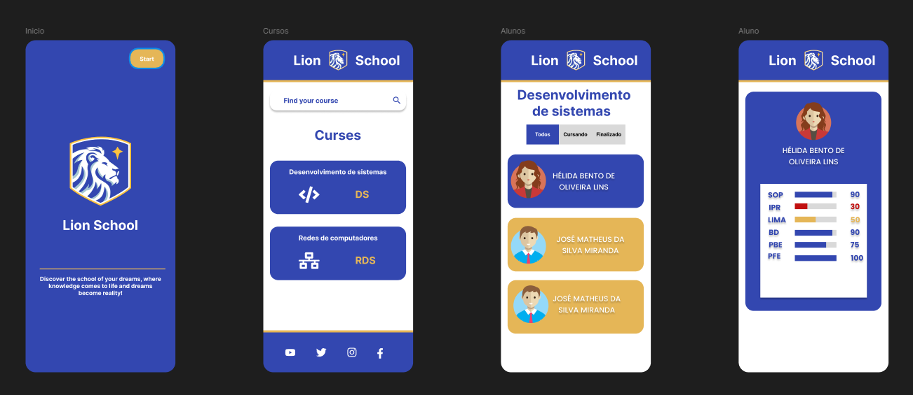

# Lion-School-Mobile

---
## Sobre
Projeto mobile realizado com Kotlin (Jetpack Compose) para consumir APIs realizadas por mim em Node.js.
Objetivo deste projeto é colocar em prática os conhecimentos, sobre desenvolvimentos Mobile nativo, adquiridos no curso do SENAI de Jandira.

## Tecnologias utilizadas
- Kotlin ( Jetpack Compose )
- Node.js

  
---
## Autor 
- [Claudio Sousa](https://github.com/ClaudioSousa44)
